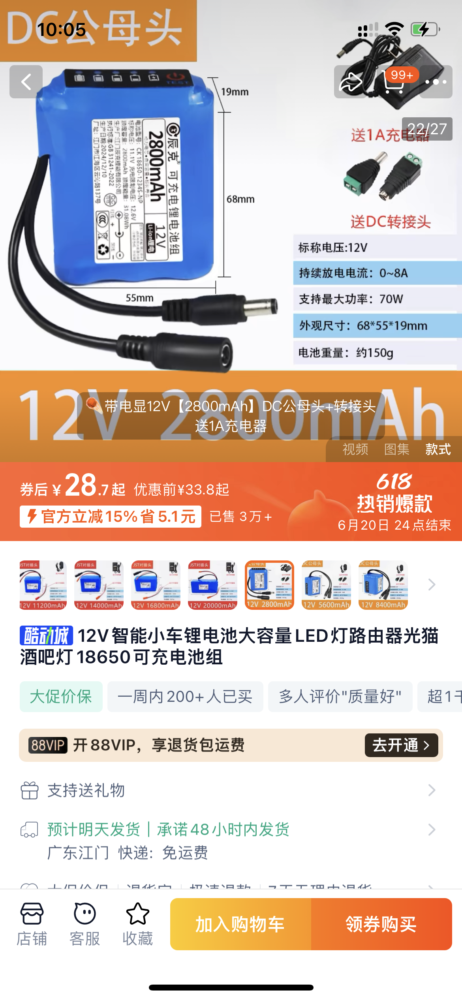
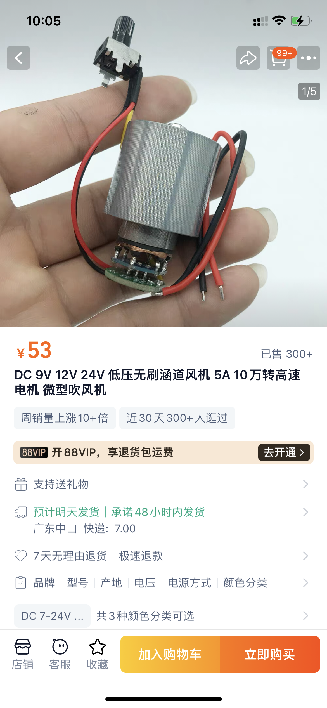
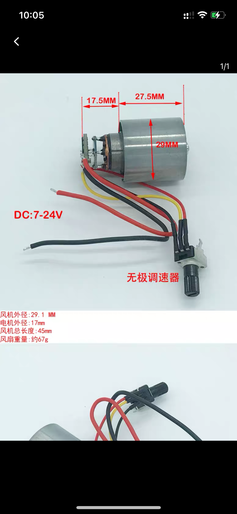
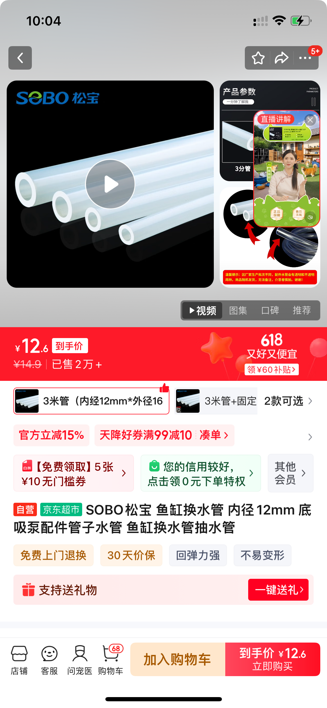
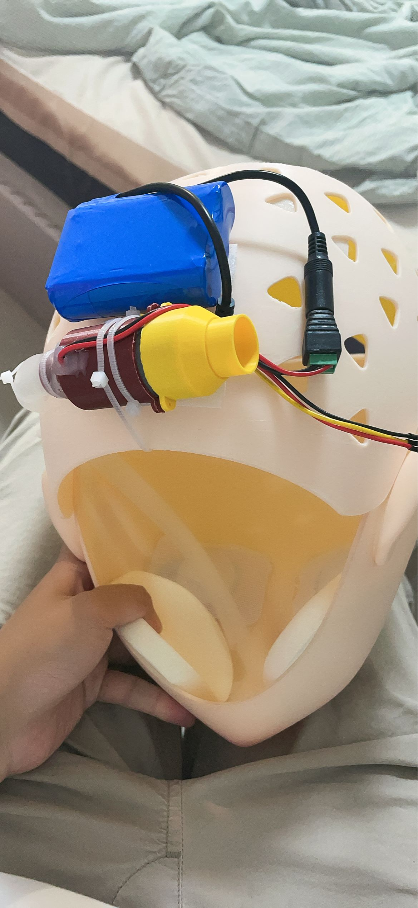

🌀 涡轮通风散热系统安装教程（Turbo Ventilation System）
=========================================

📘 简介
-----

涡轮通风散热系统是一套用于**提升Kigurumi/兽装头部通风与散热效果**的模块化装置。该系统通过内置涵道风扇、空气导流结构和可拆卸电源单元，显著提升佩戴时的舒适度，尤其适用于高温环境或长时间穿戴场景。

* * *

🧰 所需材料与工具
----------

### 🔧 打印部件（本仓库提供）

* `motor_holder-Body`, ` motor_holder2-Body`：涵道风扇固定架

### 🛒 建议购买成品

* 18650*3 12V锂电池（2800mAh）
  
  

* 7-24V 涵道风扇（带电调和转速控制器，电路板部分为出风口）

* 

* 

* 内径12mm，外径16mm橡胶管、内径17mm，外径22mm橡胶管（可选）

* 

### 🧵 其他工具

* 3D打印机（推荐FDM）,如无可淘宝未来工厂代为打印

* 螺丝刀、剪刀

* 热熔胶/泡沫胶（固定用）

* * *

🛠️ 安装步骤
--------

### 1. 打印所有模型文件

建议使用PLA材质，可用较高填充率（≥30%）以增强稳固性。

### 2. 安装风扇至支架

把电调和电源线穿过支架预留孔位（红色部件），使用螺丝或热熔胶或速干胶将风扇套住并固定， 预留孔位在穿过线材后需要使用热熔胶进行密封。

### 3. 组装电源单元

将风扇电源连接到DC端子，注意红色线为正极（+），黑色为负极（-）。

### 4. 安装软管

将软管安装至支架，使用热熔胶和扎带进行密封固定，图中红色部分（较小）为出风口，黄色部分（较大）为进风口，如果进风受限，可以使用17mm软管延长改变进风位置

### 5. 安装至头套

先将软管安置好并用扎带固定后，将整套系统安装至头壳适合的区域，用纳米胶或魔术贴或热熔胶和扎带进行固定，尽量固定牢固。

### 6. 测试运行

佩戴前测试通电是否正常，注意风道通畅无异响。 

* * *

🧷 注意事项
-------

* 在固定在头壳上时，可以先粘一层纳米胶再使用热熔胶固定，方便拆除。

* 本系统在测试时最低功率即可满足进风需求，单块电池足够支持一日使用。

* 本系统为DIY结构，请根据自己头套空间合理调整布局，避免影响外观与佩戴稳定性。
